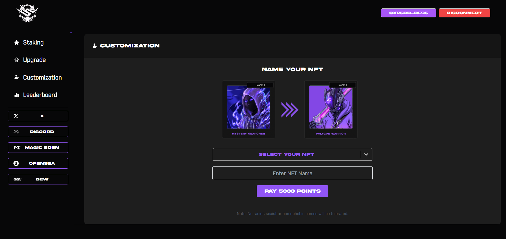

# Soul Searchers Staking DApp

Welcome to the official repository for the Soul Searchers Staking DApp, a distinctive project on the Polygon blockchain developed by Decypher Labs for our esteemed client. This innovative platform enables users to stake their Soul Searchers NFTs, earn points, and use these points to upgrade NFT artwork and customize names. Such upgrades not only enhance the NFTs' aesthetic appeal but also increase their point-earning potential, fostering a dynamic and engaging ecosystem.

## Features

- **NFT Staking**: Stake your Soul Searchers NFTs to earn points.
- **Art Upgrades**: Use points to upgrade the art of your NFTs, increasing their value and point-earning capacity.
- **Name Customization**: Customize your NFT names, reflecting changes directly in the metadata.
- **Enhanced Earnings**: Upgraded NFTs earn more points, accelerating your rewards.

## Getting Started

### Requirements

- A web3-enabled browser (e.g., Chrome with MetaMask, Brave, Firefox with MetaMask).
- A Polygon wallet loaded with Soul Searchers NFTs and Matic for transaction fees.

### How to Engage

1. **Connect Your Wallet**: Visit the Soul Searchers Staking DApp and connect your Polygon wallet.
2. **Stake Your NFTs**: Choose the NFTs you wish to stake and confirm the transaction to start earning points.
3. **Upgrade and Customize**: Use your earned points to upgrade NFT art and customize names via the DApp's interface.
4. **Earn More Points**: Enjoy increased point earnings from your upgraded NFTs.

## Interface Overview

The Soul Searchers Staking DApp boasts a user-friendly interface designed to facilitate easy navigation and interaction with its unique features.

### Staking NFTs

Begin your journey by staking Soul Searchers NFTs and start accumulating points.

### Upgrading Art

Use your points to select and apply art upgrades to your NFTs, enhancing their visual appeal and value.

### Customizing Names

Customize the names of your NFTs, with changes reflected directly in the metadata, personalizing your collection.

## Acknowledgments

This project is a collaborative effort between Decypher Labs and our client, highlighting the innovative potential when technology meets creativity in the NFT space.
Thank you for being a part of the Soul Searchers ecosystem. Let's explore the boundaries of NFT innovation together.
